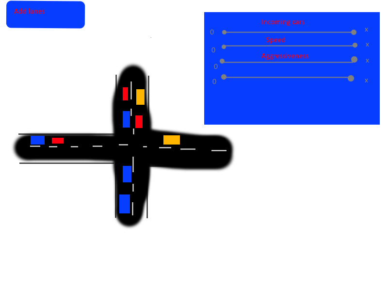

# Harjoitustyön suunnitelma

## Tietoja 

Tekijä: Luka Rantalainen

Työ git-varaston osoite: https://gitlab.jyu.fi/lujivera/ohj1ht

Pelin nimi: Traffic Sandbox

Pelialusta: Windows

Pelaajien lukumäärä: 1

## Pelin tarina

Hauska peli, jossa voi sekä yrittää pelata liikennesääntöjä noudattaen ja aiheuttaa kolareita.

## Pelin idea ja tavoitteet

Sandbox-peli, jossa pelaaja voi ohjata liikennettä miten haluaa.

## Hahmotelma pelistä

## Toteutuksen suunnitelma

Helmikuu

- Kartan teko
- Autot kartalle
- Kartan vaihtaminen

Maaliskuu

- Nopeuden muuttaminen
- Autojen määrän muuttaminen
- Autojen aggressiivisuus

Jos aikaa jää

- Räjähdykset ja muut (kaaostila)
- Muut ominaisuudet autoille/kuljettajille
- Lisää preset karttoja
